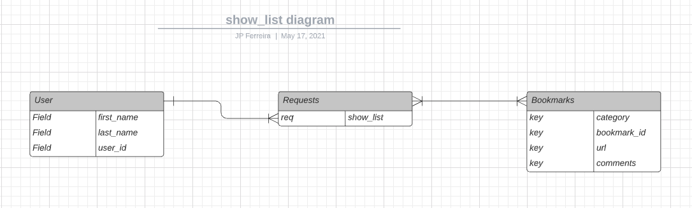
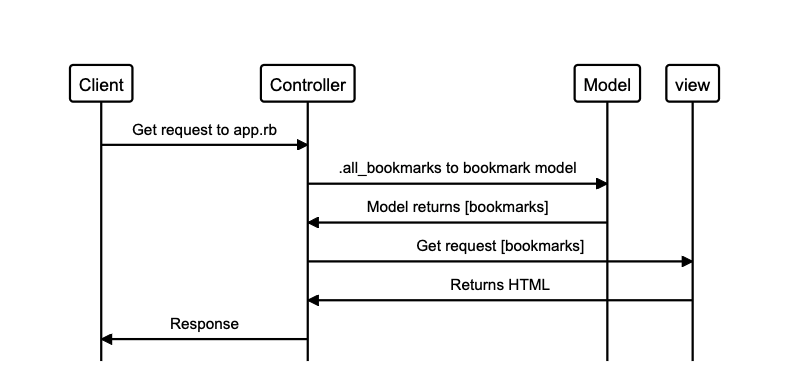

# Project Title
## Rock, Paper, Scissors, Lizard, Spock

# User Stories

As a user
So that i can see the webistes I regularly visit
I want to be able to see a list of bookmarks

|            Object               |            Method               |
|:-------------------------------:|:-------------------------------:|
|            User                 |                                 |
|            Bookmarks            |          .all_bookmarks()       |

### And some Advanced 'extension' User Stories:

## Motivation

## Build status

## Code style

## Tech/framework used

## Built with

## Installation

## Tests

## Screenshots

## How to use?

## Credits
* JP Ferreira
* Dewald Viljoen
