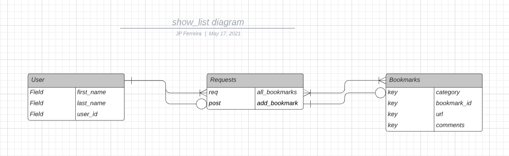

# Project Title
## Rock, Paper, Scissors, Lizard, Spock

# User Stories

As a user 
So that i can see the webistes I regularly visit 
I want to be able to see a list of bookmarks

|            Object               |            Method               |
|:-------------------------------:|:-------------------------------:|
|            User                 |                                 |
|            Bookmarks            |          .all_bookmarks         |

As a time-pressed user 
So that I can save a website 
I would like to add the site's address and title to bookmark manager

|            Object               |            Method               |
|:-------------------------------:|:-------------------------------:|
|            User                 |                                 |
|            Bookmarks            |          .add_bookmarks         |

## Motivation

## Build status

## Code style

## Tech/framework used

## Built with

## Installation

### Setting Up a PostgreSQL Database

* Connect to psql
* Create the database using the psql command CREATE DATABASE bookmark_manager;
* Connect to the database using the pqsl command \c bookmark_manager;
* Run the query we have saved in the file 01_create_bookmarks_table.sql

## Tests

## Screenshots

## How to use?

## Credits
* JP Ferreira
* Dewald Viljoen
